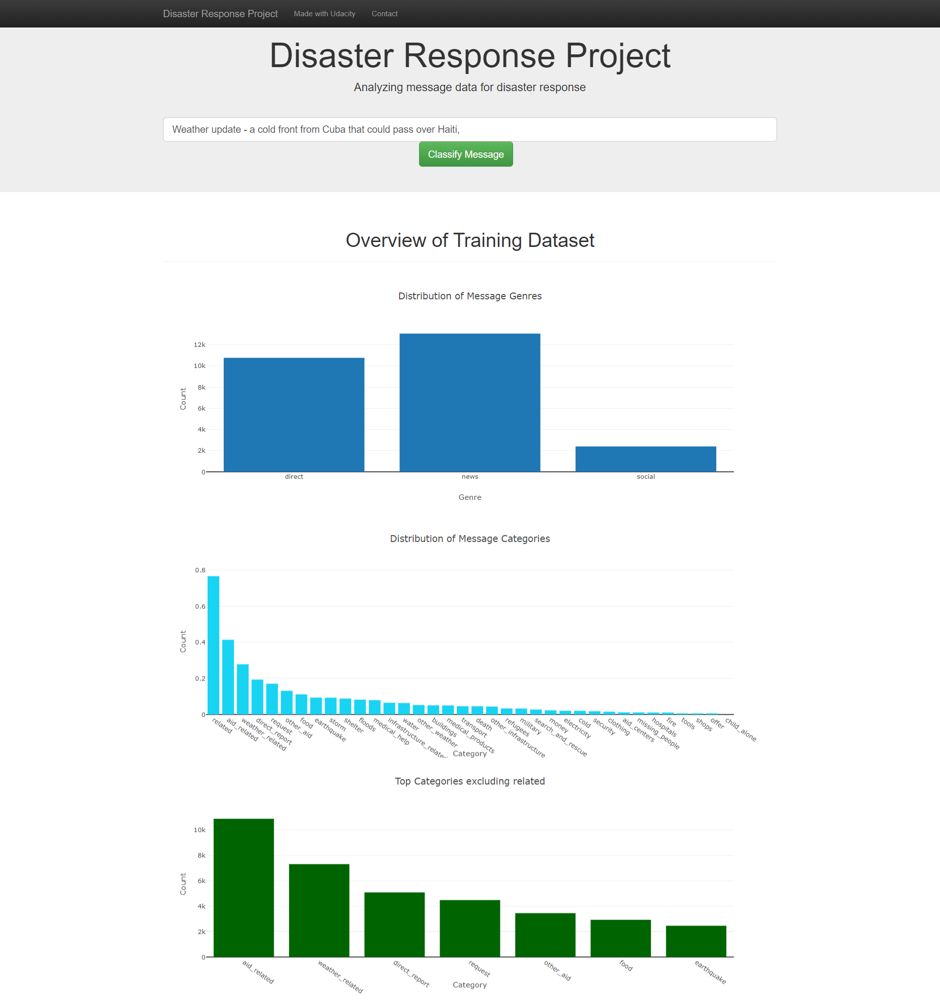

# Disaster Response Pipeline

### Summary:

In this project messages sent during a disaster get classified and categorized into 36 different classes. 
For example an emergency worker can add a message and gets a classificatio ninn several categories.

### Project Components:
#### Data file:
- messages and categories csv files
- process_data.py:
  - loads messages and categories
  - merges the datafiles
  - cleans the files
  - stores it in a SQLite database
  
#### Model file:
train_classifier.py:
- loads data of SQLite database 
- Splits dataset into training and test
- Builds a text processing and ml pipeline
- trains and tunes the model with gridsearch
- outputs results on test set
- exports model to pickle file

#### App file:
run.py:
- flask webapp
- loads dataset
- plotly for visualizationn

### Instructions:
1. Run the following commands in the project's root directory to set up your database and model.

    - To run ETL pipeline that cleans data and stores in database
        `python data/process_data.py data/disaster_messages.csv data/disaster_categories.csv data/DisasterResponse.db`
    - To run ML pipeline that trains classifier and saves
        `python models/train_classifier.py data/DisasterResponse.db models/classifier.pkl`

2. Run the following command in the app's directory to run your web app.
    `python run.py`

3. Go to http://0.0.0.0:3001/ or http://localhost:3001

### To-Dos:
- Imbalance in dataset need to be resolved through resampling / oversampling / undersampling
- add other charts
- change output site
- add disaster relief agency connection
